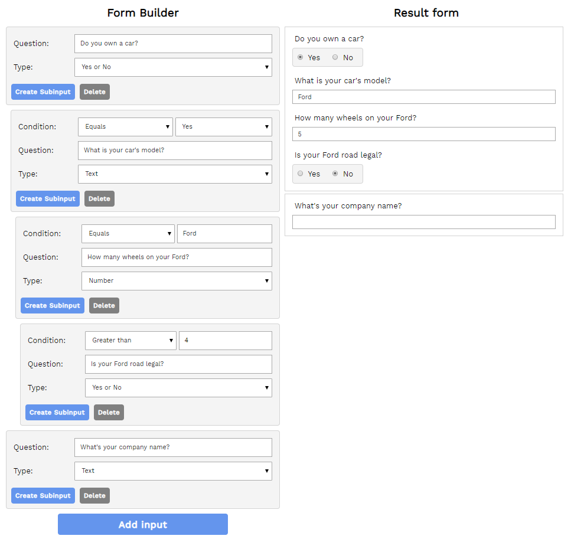

# Form-builder-react-redux
This application is a tool allowing users to build their own, custom forms.

# General description

User starts to build his form from base inputs - there are three to choose:
-   text input - standard text input type.
-   yes/no - input with two radio buttons Yes and No,
-   number - standard number input type.

Every input can be later deleted or has new subinputs inserted. If user decides to insert
subinput, It has additional configuration required. User has to specify when the subinput
will be visible. Criteria depends on parent type:
-   in case of text/yes_no input - praent value has to be equal to the specific value,
-   in case of number input - there are three possible criteria:
    -   number from parent value equals specific value,
    -   number from parent value is greater than specific value,
    -   number from parent value is lesser than specific value,

When user configures the form, it's result is instantly generated on the other side of
the page. It can be tested instantly.

# Installation

Application can be easily started by using commands 'npm install' to instal the node_modules
and 'npm start' to run application on localhost server. It will start most likely on 8080 port.

# Purpouse and technology

I've made this application as a recruitment task - it was the opportuninity to practice my
skills and to challenge myself by finding quick solutions for specific tasks. 

I decided to use JavaScript React - I'm very familliar to this framework and I could easly start to code.
This application required to create recursive data structures - react components could fit 
to this role very easily. 

I also used Redux in my application - I created a store with important data, which is
immutable and can be easily avaliable to connected components (containers). 

I used indexedDB to store data - this application has no backend and I wanted to store 
data at least locally (and of course that was the requirement in wireframe i've got). 
Application connects to the db and populates it's state with the content.

I used Webpack mostly for babel loader which allowed me to use newest ES features in my
code.

Site should behave responsively and look good even on phones - I used specific media queries
for that, although I didn't have to much time to test it. I simply didn't want for entire
site to spill when it's to narrow.

# File structure

Entire project consist mostly of src folder - there were no need to build the site, only to
run it locally. Src folder structure is listed below:
*   components - all application compomnents which are not conneted to the redux store,
*   containers - 'smart' components containing main parts of application, which are connected to the redux store and distribute data from it,
*   services - files with logic divided to the specific part of application,
*   store - everything about redux: actions file with action creators, actionTypes file and reducer  file.

# Application preview

Below there is a small example of form with few inputs and subinputs configured.

